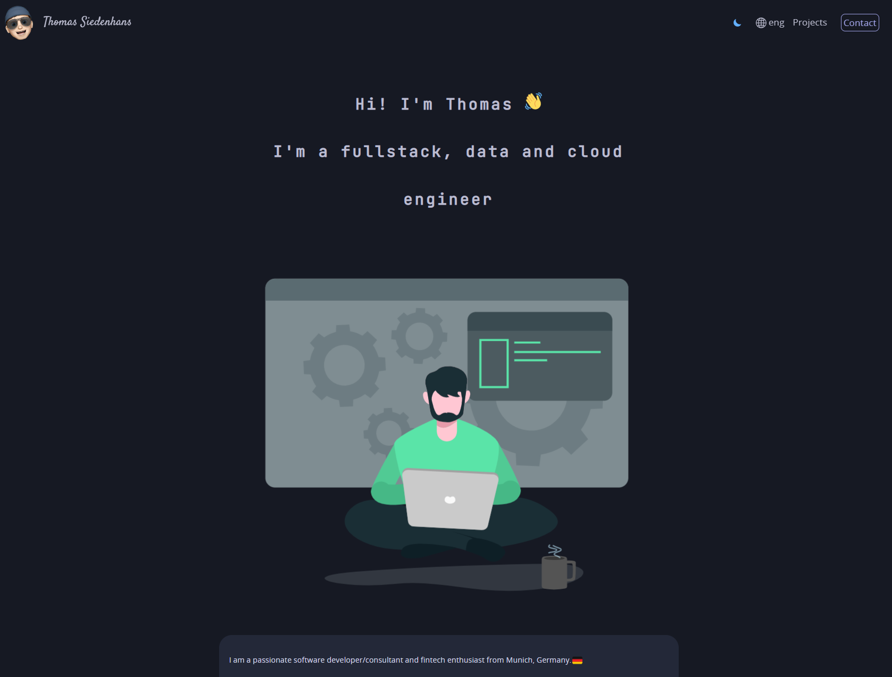

### My portfolio website

I am passionate about Rust and have built enough websites with JavaScript and wanted to try something new. That's why I built my portfolio website in Rust with Yew compiling to WebAssembly (WASM).

Quick deployment guide:

- clone this repo && cd into the folder and run following commands
- cargo install --path .
- rustup target add wasm32-unknown-unknown
- npm run dev

<a href="https://thomas.siedenhans.net">https://thomas.siedenhans.net</a>

> written entirely in rust with the yew framework & compiled to WASM.  
> Licensed under `MIT`

Based on a website from Marc Mäurer.
(Check MIT License Agreement)
